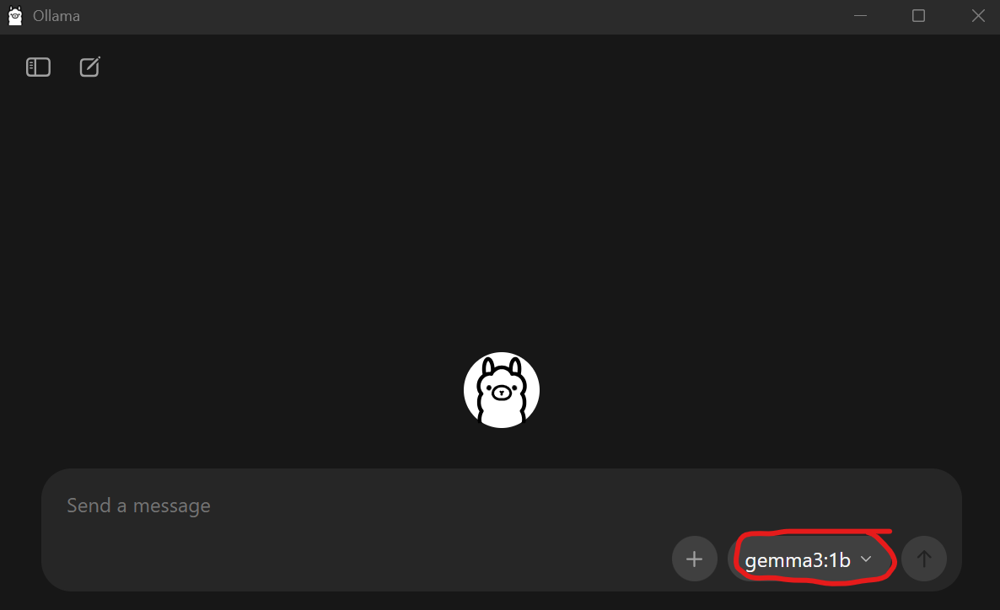

# Pre-assignment 5

Feel free to reach out to me (natashap@mit.edu) if you have any questions. Have fun!

**Submit to Canvas**: 

    (1) A screenshot of the chat window after you've completed Step 3. 

    (2) A screenshot of the final output from the Ollama notebook section in Step 4.
    
    (3) A screenshot of the final output from the Hugging Face notebook section in Step 5.

## Instructions

1. Ollama is an open-source platform for using locally installed LLMs and interacting with these models programatically. Download the Ollama installation package for your operating system here: https://ollama.com/download. Follow the on-screen instructions to install Ollama on your local machine. 

2. The following user interface should pop up immediately after installation. But no worries if it doesn't - you can open the Ollama app by finding it in your applications folder (macOS) or from the Start menu (Windows): 

3. Click on the drop-down menu for model selection (circled in red in the screenshot above) and click "gemma3:1b" (this is a smaller model with 1 Billion parameters that doesn't require a lot of memory or computational resources). Then enter a simple question into the chat box and hit enter. The gemma3 model will first download, and then an answer to your query will be returned.

This is a nice chat-window interface for interacting with your downloaded AI models. But we also want more low-level control to integrate these models into our workflows. Let's go ahead and try it out!

4. Run the Ollama section of the pre-assignment Jupyter Notebook (Pre-assignment 5.ipynb). This will help you get started with Ollama models in Python. In our session, we'll look at more advanced uses, along with downloading + running models from the CLI.

5. Hugging Face hosts a large online repository of pre-trained models. Their Transformers library provides convenient APIs for loading and fine-tuning state-of-the-art models. The Transformers library works with PyTorch, which also provides more low-level control over building and training our own deep learning models from scratch. Run the Hugging Face section of the pre-assignment Jupyter Notebook (Pre-assignment 5.ipynb) to make sure you have everything installed and ready.

Each pre-trained model on Hugging Face should have an accompanying "model card" - which is a document that contains information on the model's architecture, intended use, training data & procedure, performance metrics, limitations, etc. 

If you're curious, here's the model card for bert-base-uncased: https://huggingface.co/google-bert/bert-base-uncased 

